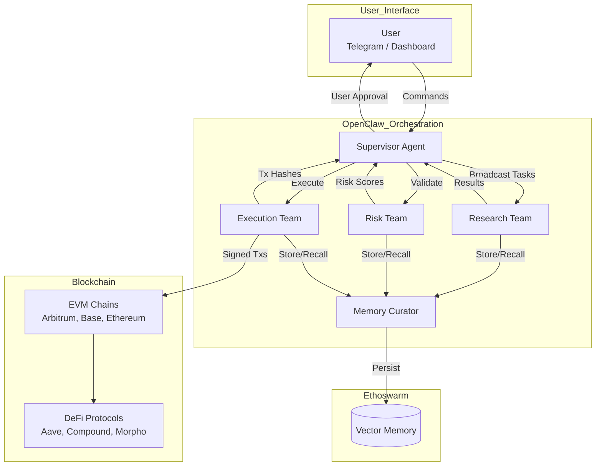
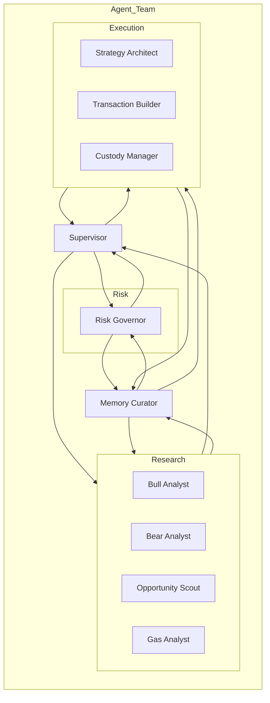
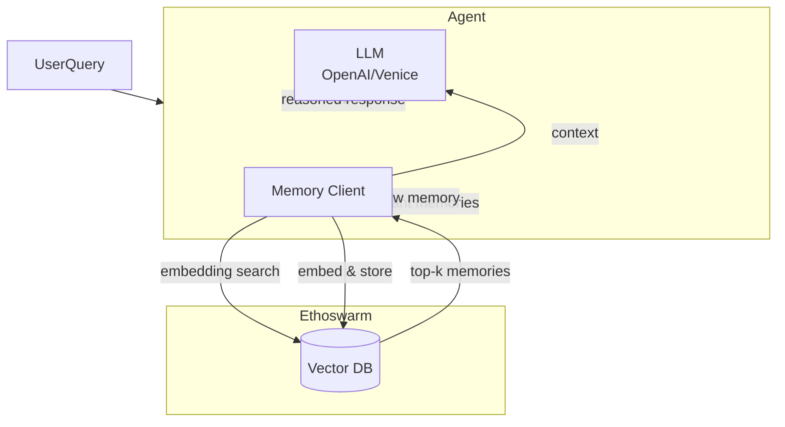
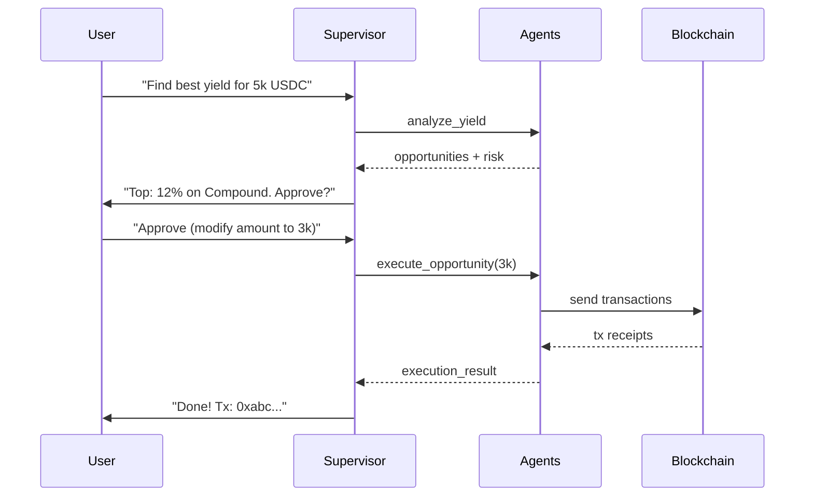

# DeFi Ghost

<div align="center">
  
  <br/>
  <strong>Your autonomous, multi‑agent financial co‑pilot for DeFi yield optimization.</strong>
</div>

<p align="center">
  <a href="https://github.com/defighost/defighost/actions"></a>
  <a href="https://github.com/defighost/defighost/blob/main/LICENSE"></a>
  <a href="https://discord.gg/defighost"></a>
  <a href="https://twitter.com/defighost"></a>
</p>

---

## Overview

**DeFi Ghost** is an intelligent, multi‑agent system that autonomously monitors, analyzes, and executes DeFi yield opportunities while keeping you in control. Each agent is a specialized “Mind” powered by **Animoca Minds (Ethoswarm)** with persistent memory, identity, and cognition. Agents collaborate as a team – debating, validating, and planning – to deliver optimal, risk‑adjusted yields 24/7.

The system is built on **OpenClaw Agent Teams** for orchestration, uses **OpenAI** or **Venice.ai** for reasoning, and interacts with EVM chains via **Web3**. Whether you're a DeFi novice or a power user, DeFi Ghost becomes your always‑on financial co‑pilot.

---

## Features

- **Multi‑Agent Intelligence** – A team of specialized agents (Research, Risk, Execution) that work together.
- **Persistent Memory** – Every agent remembers past interactions, trades, and user preferences via Ethoswarm vector database.
- **Human‑in‑the‑Loop** – You always approve final execution; agents learn from your decisions.
- **Cross‑Chain & Multi‑Protocol** – Supports Ethereum, Arbitrum, Base, and protocols like Aave, Compound, Morpho.
- **Natural Language Interface** – Talk to the Supervisor via Telegram or web dashboard.
- **Real‑Time Monitoring** – Dashboard with agent activity feed and memory ticker.
- **Sponsor Integrated** – Built with Animoca Minds, OpenClaw, OpenAI/Venice.ai.

---

## Table of Contents

- [Architecture](#architecture)
- [Agent Team](#agent-team)
- [Memory & Cognition](#memory--cognition)
- [Human‑in‑the‑Loop](#human-in-the-loop)
- [Tech Stack](#tech-stack)
- [Getting Started](#getting-started)
  - [Prerequisites](#prerequisites)
  - [Installation](#installation)
  - [Configuration](#configuration)
  - [Running the System](#running-the-system)
- [Usage Examples](#usage-examples)
- [API Reference](#api-reference)
- [Testing](#testing)
- [Contributing](#contributing)
- [License](#license)
- [Acknowledgements](#acknowledgements)

---

## Architecture

DeFi Ghost follows a **hierarchical multi‑agent architecture** orchestrated by OpenClaw. The diagram below illustrates the main components and their interactions.



**Key Flows**:
1. User sends a natural language query (e.g., *“find best yield for 5k USDC”*).
2. **Supervisor** broadcasts to Research Team.
3. Research agents (Bull, Bear, Scout, Gas) analyze in parallel.
4. Supervisor compiles results and asks **Risk Governor** to validate.
5. Risk‑approved opportunities are presented to the user.
6. Upon approval, **Execution Team** plans, builds, and sends transactions.
7. All actions are stored in **Ethoswarm** memory for future learning.

---

## Agent Team

Each agent is a unique “Mind” with its own identity, persona, and memory.

| Agent | Role | Personality |
|-------|------|-------------|
| **Supervisor** | Orchestrates the team, chats with user | Friendly, efficient, clear |
| **Market Analyst Bull** | Highlights positive trends and opportunities | Optimistic, trend‑follower |
| **Market Analyst Bear** | Plays devil’s advocate, flags risks | Cautious, skeptical |
| **Opportunity Scout** | Scans all protocols/chains for yield spikes | Curious, data‑driven |
| **Gas & MEV Analyst** | Monitors gas prices and MEV risk | Precise, cost‑conscious |
| **Risk Governor** | Validates opportunities against user profile | Protective, authoritative |
| **Strategy Architect** | Designs multi‑step transaction plans | Methodical, structured |
| **Transaction Builder** | Constructs raw calldata for each step | Technical, precise |
| **Custody Manager** | Signs and submits transactions | Secure, reliable |
| **Memory Curator** | Handles all persistent memory operations | Retentive, wise |



<<<<<<< Updated upstream
---
=======
## Lovable compatibility

This project is set up to work with [Lovable](https://lovable.dev):

- **Build**: Standard Vite + React; `npm run build` produces static assets. The `lovable-tagger` plugin runs in development only so production builds stay clean.
- **Base path**: Set `VITE_BASE` (e.g. `/app/`) in your environment if the app is served from a subpath.
- **Backend API**: Set `VITE_API_BASE` to your backend URL when deploying the frontend separately (e.g. `https://api.example.com`). If unset, the app uses relative `/api` (works with the dev proxy or same-origin backend). The UI degrades to a demo mode when the backend is unreachable.

## How can I deploy this project?
>>>>>>> Stashed changes

## Memory & Cognition

All agents leverage **Ethoswarm** for persistent vector memory. Memories are stored as embeddings and retrieved via semantic search, enabling Retrieval‑Augmented Generation (RAG) for informed decision‑making.

**Memory Types**:
- **Episodic**: Past trades, outcomes, user feedback.
- **Semantic**: Protocol knowledge, APY histories.
- **Procedural**: How to execute specific actions.
- **User‑specific**: Risk profile, preferences, blacklists.

**Cognition**:
- **Reasoning**: Agents use LLMs (GPT‑4 / Venice.ai) with persona‑specific prompts.
- **Planning**: Strategy Architect decomposes goals into steps.
- **Learning**: Outcomes update agent reputations and memory.



---

## Human‑in‑the‑Loop

While agents work autonomously, **you remain in control**. The system enforces a **progressive autonomy model**:

1. **Initial Setup**: User defines risk limits, preferred protocols, blacklists.
2. **Opportunity Presentation**: Supervisor shows top opportunity with full reasoning and risk score.
3. **Approval Required**: User must explicitly approve or modify parameters before execution.
4. **Learning**: The system learns from approvals/rejections and adjusts future suggestions.

This balance ensures both convenience and safety.



---

## Tech Stack

| Component          | Technology                                                                 |
|--------------------|----------------------------------------------------------------------------|
| Agent Framework    | [OpenClaw Agent Teams](https://openclaw.xyz)                               |
| Memory & Identity  | [Animoca Minds (Ethoswarm)](https://ethoswarm.xyz)                         |
| LLM                | OpenAI GPT‑4 / Venice.ai                                                   |
| Blockchain         | Ethereum, Arbitrum, Base (via Web3.py)                                     |
| Smart Contracts    | Aave, Compound, Morpho, Moltbook                                           |
| Short‑Term Storage | Redis                                                                      |
| Embeddings         | Sentence‑Transformers (all‑MiniLM‑L6‑v2)                                   |
| Frontend           | Next.js, React, Tailwind CSS, Framer Motion                                |
| Deployment         | Docker, Kubernetes (optional)                                              |

---

## Getting Started

### Prerequisites

- Python 3.10+
- Redis (for short‑term working memory)
- API keys for:
  - [OpenClaw](https://openclaw.xyz)
  - [Ethoswarm](https://ethoswarm.xyz)
  - OpenAI or Venice.ai
- Ethereum RPC endpoints (Infura, Alchemy, etc.)

### Installation

Clone the repository:

```bash
git clone https://github.com/defighost/defighost.git
cd defighost
```

Create a virtual environment and install dependencies:

```bash
python -m venv venv
source venv/bin/activate   # On Windows: venv\Scripts\activate
pip install -r requirements.txt
```

### Configuration

Copy the example environment file and fill in your keys:

```bash
cp .env.example .env
```

Edit `.env`:

```ini
# OpenClaw
OPENCLAW_API_KEY=your_key
OPENCLAW_TEAM_ID=your_team

# Ethoswarm
ETHOSWARM_API_KEY=your_key
ETHOSWARM_MEMORY_STORE_ID=your_store

# LLM Provider (openai or venice)
LLM_PROVIDER=openai
OPENAI_API_KEY=sk-...
# or
VENICE_API_KEY=...
VENICE_API_BASE=https://api.venice.ai/v1

# RPC URLs
ETH_RPC_URL=https://eth-mainnet.g.alchemy.com/v2/...
ARBITRUM_RPC_URL=https://arb-mainnet.g.alchemy.com/v2/...
BASE_RPC_URL=https://base-mainnet.g.alchemy.com/v2/...

# Redis
REDIS_URL=redis://localhost:6379
```

### Running the System

1. **Start Redis**:
   ```bash
   redis-server
   ```

2. **Deploy the agent team** using OpenClaw:
   ```bash
   python scripts/deploy_agents.py
   ```

3. **Launch the frontend dashboard** (optional):
   ```bash
   cd frontend
   npm install
   npm run dev
   ```

4. **Connect a channel** (e.g., Telegram) via OpenClaw dashboard or API.

5. **Interact with your Ghost** via Telegram or `http://localhost:3000`.

---

## Usage Examples

### Example 1: Simple Yield Query

**User**: *"Find me the best yield for 5,000 USDC on Arbitrum."*

**Agent Activity** (as seen in dashboard):
- 🕵️ Opportunity Scout: Scanning Aave v3 (Arbitrum): 8.2% APY  
- 🕵️ Opportunity Scout: Scanning Compound v3 (Arbitrum): 12.5% APY  
- 📈 Bull Analyst: Compound rate looks strong, TVL growing  
- 📉 Bear Analyst: Utilization 95% – withdrawal risk  
- ⛽ Gas Analyst: Gas on Arbitrum: 0.12 gwei ($12 est.)  
- 🛡️ Risk Governor: Risk score 3/10, within user limits  

**Supervisor**: *"Top opportunity: 12.5% APY on Compound (Arbitrum). Risk score 3/10. Estimated gas: $12. Approve?"*

**User**: *"Approve with 3,000 USDC only."*

**Supervisor**: *"Modified amount to 3,000 USDC. Preparing transaction..."*

*(After execution)*  
**Supervisor**: *"✅ Funds deployed! Transaction: 0xabc123..."*

### Example 2: Portfolio Status

**User**: *"What's my current DeFi Ghost status?"*

**Supervisor**: *"You have 15,000 USDC deployed across 3 positions:*
- *8,000 USDC on Aave (Arbitrum) @ 8.2% APY*
- *5,000 USDC on Compound (Base) @ 9.1% APY*
- *2,000 USDC idle in wallet*

*Total estimated monthly yield: $112. Last trade: 2 days ago. Any new opportunities?*"

---

## API Reference

DeFi Ghost exposes a REST API (optional) for integration with other services.

### `POST /api/query`

Send a natural language query.

**Request Body**:
```json
{
  "user_id": "user_123",
  "message": "Find best yield for 5k USDC",
  "channel": "api"
}
```

**Response**:
```json
{
  "task_id": "task_abc",
  "status": "processing"
}
```

### `GET /api/task/{task_id}`

Get task status and result.

**Response**:
```json
{
  "task_id": "task_abc",
  "status": "completed",
  "result": {
    "opportunity": { ... },
    "tx_hash": "0x..."
  }
}
```

Full API documentation is available at `/docs` when running the dashboard.

---

## Testing

Run unit tests:

```bash
pytest tests/
```

For integration tests (requires testnet RPC):

```bash
pytest tests/integration/ --rpc=your_testnet_rpc
```

---

## Contributing

We welcome contributions! Please see our [Contributing Guidelines](CONTRIBUTING.md).

- Report bugs via [Issues](https://github.com/defighost/defighost/issues).
- Submit pull requests for new features or fixes.
- Join our [Discord](https://discord.gg/defighost) for discussion.

---

## License

DeFi Ghost is open‑source software licensed under the [MIT License](LICENSE).

---

## Acknowledgements

DeFi Ghost was built during the **UK AI Agent Hackathon EP4 x OpenClaw** and would not be possible without the support of our sponsors:

- **Animoca Brands** – for the Animoca Minds framework and Ethoswarm memory layer.
- **OpenClaw** – for the agent orchestration platform.
- **OpenAI** and **Venice.ai** – for language model capabilities.
- **Ethereum, Arbitrum, Base** – for the blockchain infrastructure.

Special thanks to the hackathon organizers and mentors for their guidance.

---

<div align="center">
  
  
  
  
  
  
</div>

---

**Built with ❤️ by the DeFi Ghost Team**


